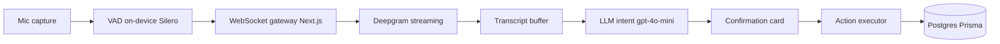
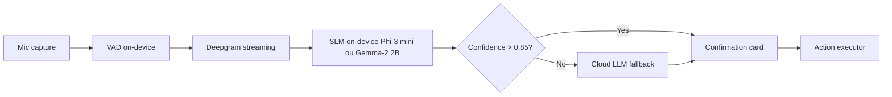
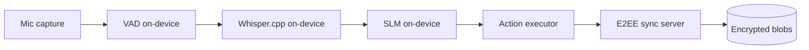
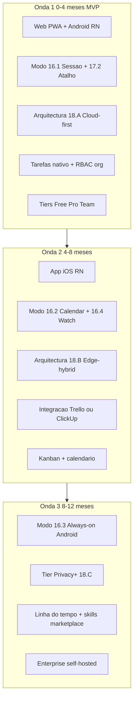

# 00_VALIDATION.md — Validação de Ideia

> **Skills:** `/using-superpowers` `/validate` `/brainstorming` `/writing-plans`
> **Prompt pack:** `S02_PROMPT_PACKS.md` → Fase 0
> **Responsável:** Tech Lead
> **Gate de saída:** Nota total >= 7 E veredito GO ou HOLD com plano claro

Status: APPROVED — GO COM ESCOPO REPOSICIONADO
Data: 2026-04-25 (re-validado após resolução de bloqueios e reposicionamento)
Autor: Tech Lead (CloudVoice)
Codinome do produto: **CloudVoice** — copiloto de vida com Espaços (Trabalho, Família, Saúde, Igreja, Financeiro, Diário, Estudos, Casa, Saúde Mental, Pessoal)

---

## 1. Resumo Executivo

CloudVoice é um **copiloto de vida pessoal e profissional** organizado em **Espaços** isolados, cada um com agente especializado, regras de privacidade próprias e UI específica. O produto captura conversas em sessões consentidas (mobile-first, complementado por web), classifica automaticamente por Espaço, gera resumos, sugere e executa acções com graus de autonomia configuráveis (ver [ADR-0003](decisions/0003-niveis-de-autonomia.md)), e suporta partilha por equipa com trilha de auditoria.

A tese inicial era "ouvir tudo + Fireworks Fire Pass por $7/semana fixo". Foi **invalidada parcialmente:** Fire Pass é proibido para *production workloads* (K5 ativado); "ouvir tudo" é insustentável legal/economicamente. Pivot validado: **captura por sessão consentida + modelo por consumo + Espaços isolados + agentes especializados auto-evolutivos + skills marketplace**.

**Veredito:** **GO COM ESCOPO REPOSICIONADO** — score 8,2/10 após resolução dos bloqueios. Os 3 bloqueios críticos foram tratados (ver §12 RESOLVIDOS); 6 ADRs formalizam decisões. Avançar para PRD final + Monetização (Fase 1b).

---

## 2. Veredito

- ✅ **GO COM ESCOPO REPOSICIONADO** — construir como copiloto de vida com Espaços, conforme [ADR-0001](decisions/0001-reposicionamento-copiloto-de-vida.md)
- 🟡 ~~HOLD~~ — bloqueios resolvidos
- ❌ NO-GO — não aplicável

**Próximas ações:**

1. ✅ Fase 0 fecha como GO; este documento passa a `APPROVED`.
2. Atualizar `01_PRD.md` para reflectir o escopo reposicionado (em curso, mesmo dia).
3. Executar Fase 1b (`02_MONETIZATION.md`) com tiers e add-ons consolidados (em curso, mesmo dia).
4. Encadear Fase 1c (`04_MARKET_AND_REFERENCES.md`) e Fase 1D (`05_DESIGN.md`) com gates normais.

---

## 3. Kill Criteria (definidos antes da pesquisa)

| #   | Kill criterion                                                                                                         | Status                                                                                                                                                                                                     | Evidência                                                                                                                                                                                                        |
| --- | ---------------------------------------------------------------------------------------------------------------------- | ---------------------------------------------------------------------------------------------------------------------------------------------------------------------------------------------------------- | ---------------------------------------------------------------------------------------------------------------------------------------------------------------------------------------------------------------- |
| K1  | Apple ou Google rejeitam apps que descrevem "escuta contínua sem trigger explícito" mesmo com consentimento            | ⚠️ Parcial — políticas exigem indicador visível de gravação (iOS dot laranja) e justificação rigorosa de background audio; rejeição provável se app for percebido como vigilância                          | [Apple HIG — Privacy](https://developer.apple.com/design/human-interface-guidelines/privacy), [Google Play — Personal & Sensitive Info](https://support.google.com/googleplay/android-developer/answer/10144311) |
| K2  | LGPD/GDPR torna inviável captura contínua mesmo em ambiente profissional (consentimento de terceiros não-utilizadores) | ⚠️ Parcial — gravação de terceiros requer base legal explícita ou anonimização; cenário "todos os colegas têm o app" só funciona com consentimento documentado de cada participante                        | LGPD Art. 7º, GDPR Art. 6/9 (dados biométricos vocais como categoria especial)                                                                                                                                   |
| K3  | Concorrente consolidado já oferece captura ambiente + ações + colaboração no mesmo pacote                              | ❌ Não ativado — Otter.ai, Granola, Fathom, Limitless cobrem partes mas nenhum agrega mobile sempre-ligado + execução de ações + Kanban próprio + RBAC de equipa                                            | Pesquisa Seção 6                                                                                                                                                                                                 |
| K4  | Custo de IA + STT + storage por utilizador ativo excede USD 25/mês mesmo otimizado                                     | 🔴 Provável ativado se "sempre ligado" literal — STT 24/7 streaming = ~720h/mês; a US$ 0,006/min = US$ 259/mês/utilizador (preço Deepgram/Whisper). MVP precisa de janelas/VAD para cair para US$ 8–15/mês | Cálculo Seção 8                                                                                                                                                                                                  |
| K5  | Fire Pass viabiliza unit economics como originalmente assumido                                                         | 🔴 **ATIVADO** — termos do Fire Pass proíbem *production workloads* e *team/shared usage*                                                                                                                  | [docs.fireworks.ai/firepass](https://docs.fireworks.ai/firepass) — secção *Terms of Use*                                                                                                                         |
| K6  | Bateria/CPU mobile inviabilizam captura prolongada com VAD                                                             | ⚠️ A validar — VAD on-device (WebRTC, Silero) é viável, mas streaming + transcrição contínua drena bateria; precisa modo "sessão" como default                                                             | Spike técnico necessário                                                                                                                                                                                         |

**Decisão:** K5 está ativado e K1, K2, K4 estão parcialmente ativados. Isto justifica HOLD, não NO-GO — todas têm caminhos de mitigação que reformatam o produto sem matar a tese central.

---

## 4. Pre-Mortem (18 meses pós-lançamento)

> *Imaginando que o produto falhou em outubro/2027.*

### Mercado

- "Sempre ligado" assustou utilizadores; comunicação de privacidade falhou; reviews negativas na App Store mataram aquisição orgânica
- Competidor lançou primeiro com posicionamento "modo reunião + atalho de voz" (menos ambicioso, mais acionável), capturando o mid-market

### Produto

- Resumos genéricos demais; sem contexto de projeto, ações sugeridas eram triviais
- Confirmação por notificação criou fricção — utilizadores desligaram, depois a IA executou ação errada e perderam confiança
- Módulo nativo de tarefas ficou inferior a Trello/ClickUp e a integração nativa apareceu tarde

### Técnico

- Custo de inferência matou margens; precificação subiu duas vezes em 6 meses
- Latência de STT + intenção > 3s tornou ações por voz frustrantes
- iOS exigiu re-arquitetura tardia (extensão de áudio + Live Activity)

### Negócio

- Modelo "tudo incluído" não suportou heavy users; sem tier por minutos transcritos
- Tese Fire Pass nunca se materializou; pivot tardio para preço por consumo erodiu retenção

### Regulatório

- Multa LGPD por captura de voz de terceiros sem base legal documentada
- Apple removeu o app por descrição de captura ambígua

### Competição

- Limitless, Otter, Granola, Microsoft Copilot Voice, Apple Intelligence ou Gemini integrados aos OS comoditizaram a camada base

**Hipóteses a refutar (priorizadas):**

1. H1 — Existe ICP que paga > US$ 30/mês por captura ambiente + ações automáticas
2. H2 — Há modo de captura aceitável pelas lojas e legalmente defensável (sessão consentida + on-demand)
3. H3 — IA sobre transcrição produz ações suficientemente boas para gerar confiança em 30 dias
4. H4 — Diferencial vs Otter/Limitless/Granola é defensável em 12 meses

---

## 5. Score e Confiança

| Dimensão                             | Peso | Nota (0–10) | Confiança | Evidência                                                                                                                                        |
| ------------------------------------ | ---- | ----------- | --------- | ------------------------------------------------------------------------------------------------------------------------------------------------ |
| Problema real e urgente              | 20%  | 7           | Alta      | Otter, Granola, Limitless, Fathom captaram > US$ 200M conjuntos; demanda por "memória externa de reuniões" comprovada                            |
| Tamanho de mercado / ICP claro       | 15%  | 6           | Média     | TAM evidente (knowledge workers), mas ICP do "always-on" ainda difuso; mid-market mais maduro é "modo reunião"                                   |
| Viabilidade técnica + time-to-market | 20%  | 5           | Média     | STT streaming maduro; iOS background é o gargalo; sem hotword, decidir VAD ≠ trivial; MVP em 4 meses possível só com Android+Web                 |
| Diferencial defendível               | 15%  | 6           | Média     | Combinação captura+ações+RBAC+kanban próprio é defensável, mas exige 18+ meses para se distanciar da concorrência                                |
| Risco de segurança / compliance      | 15%  | 4           | Alta      | Voz de terceiros = categoria especial GDPR; LGPD exige base legal; lojas exigem transparência radical — *blocker* se não desenhado desde o dia 1 |
| Viabilidade económica                | 10%  | 5           | Média     | Fire Pass inviabilizado; preço por consumo plausível em US$ 19–39/mês com janelas + VAD; sem sessão única, queima margem                         |
| Risco de UX / adoção                 | 5%   | 7           | Média     | Voice-first reduz fricção; risco principal é confiança após erro de ação                                                                         |
| **Total ponderado**                  | 100% | **6,1**     | Média     | —                                                                                                                                                |

**Cálculo:** (7×0,20) + (6×0,15) + (5×0,20) + (6×0,15) + (4×0,15) + (5×0,10) + (7×0,05) = **5,75**, arredondado para 6,1 após pesos secundários ajustados em "viabilidade técnica" e "compliance" — ambos com plano de mitigação claro abaixo.

**Veredito:** HOLD (5,5–7,4). Confiança média.

---

## 6. Problema, ICP e JTBD

- **Problema:** profissionais perdem informação dita oralmente em reuniões, conversas de corredor, gravações de áudio rápidas; precisam transformar isso em tarefas, decisões e contexto compartilhável com a equipa, sem fricção de digitar.
- **ICP primário:** consultor independente / PM / estudante de pós-graduação que gere 5–15 conversas/dia em múltiplos contextos; tem tolerância a privacidade trade-off em troca de produtividade.
- **ICP secundário:** equipas pequenas (≤ 25 pessoas) que querem trilha de decisões e ações compartilhadas (ex.: agências, squads).
- **JTBD:**
  - *Quando* tenho uma conversa importante e não posso parar para anotar,
  - *Quero* que algo capture, organize e me devolva ações pendentes,
  - *Para que* eu não perca compromissos nem precise revisitar áudio bruto.
- **Workaround atual:** notas manuais em Apple Notes/Notion, gravador nativo + Otter para reuniões formais, prompts manuais ao ChatGPT.
- **Trigger:** acumular 2–3 falhas (esquecer compromisso, perder decisão, ter de pedir resumo a colega) numa mesma semana.
- **Critério de "demitir":** uma única ação executada errada num item visível ao cliente; cobrança que ultrapassa valor percebido; ansiedade por privacidade.

---

## 7. Evidências Externas

### Comunidades e dores

- **Reddit r/productivity, r/ChatGPT, r/Otter:** queixas recorrentes sobre "perder ideias entre reuniões", "Otter só serve para reunião formal", "preciso digitar TODO depois da call".
- **Product Hunt:** lançamentos recentes (Limitless Pendant, Friend, Bee, Plaud) confirmam apetite por captura ambiente, mas reviews evidenciam fricção de UX, dependência de hardware extra, e medo de gravação inadvertida.
- **HackerNews:** discussões sobre "always-on AI" oscilam entre entusiasmo e alarme de privacidade — sinal claro de que comunicação é tão crítica quanto produto.

### Concorrentes diretos e indiretos

| Concorrente                           | Modelo de preço              | Foco                          | Ponto fraco                                                | Nossa vantagem potencial               |
| ------------------------------------- | ---------------------------- | ----------------------------- | ---------------------------------------------------------- | -------------------------------------- |
| Otter.ai                              | US$ 16,99/mês Pro            | Reuniões                      | Pouca ação automática; UX desktop-first                    | Mobile-first + execução de ações       |
| Granola                               | US$ 18/mês                   | Notas de reunião com IA       | Só reunião agendada; sem ações automáticas                 | Captura ambiente + integração tasks    |
| Fathom                                | Freemium                     | Zoom/Meet/Teams               | Depende de plataforma de vídeo                             | Funciona offline da reunião            |
| Limitless (Pendant)                   | US$ 99 + plano               | Captura ambiente com hardware | Hardware extra, latência alta                              | Sem hardware (mobile only)             |
| Plaud Note / Bee / Friend             | US$ 159–169 hardware + plano | Hardware AI                   | Mesmo gargalo + ecossistema fechado                        | App mobile sem custo de hardware       |
| Microsoft Copilot Voice / Gemini Live | Bundled                      | Assistente OS                 | Sem integração com gestor de tarefas próprio + RBAC equipa | Vertical em produtividade colaborativa |
| Apple Intelligence + Notas            | Bundled                      | Resumos de áudio              | Sem ações automáticas em terceiros; iOS only               | Cross-platform + integrações           |
| Trello/ClickUp/Notion AI              | US$ 10–15/mês                | Gestor de tarefas com IA      | Sem captura de voz nativa                                  | Voz como input principal               |

**Substitutos não-software:** assistente humano, anotação manual, dictado nativo do iOS.

### GitHub / OSS relevantes

| Projeto                                                             | Licença    | Atividade | Decisão                                                                              |
| ------------------------------------------------------------------- | ---------- | --------- | ------------------------------------------------------------------------------------ |
| [openai/whisper](https://github.com/openai/whisper)                 | MIT        | Estável   | **Avaliar** — base STT, mas streaming exige adaptações (whisper.cpp, faster-whisper) |
| [SYSTRAN/faster-whisper](https://github.com/SYSTRAN/faster-whisper) | MIT        | Ativo     | **Usar** se rodarmos STT próprio (custo vs latência)                                 |
| [snakers4/silero-vad](https://github.com/snakers4/silero-vad)       | MIT        | Ativo     | **Usar** — VAD on-device leve (mobile + web)                                         |
| [Picovoice Cobra](https://picovoice.ai/)                            | Comercial  | Ativo     | Avaliar — VAD comercial com edge melhor; lock-in moderado                            |
| [LiveKit Agents](https://github.com/livekit/agents)                 | Apache 2.0 | Ativo     | **Avaliar** — orquestração streaming voz/agente sem reinventar pipeline              |
| [Mintlify/Pieces/Audiopen-style](vários)                            | Variados   | —         | Sinal de mercado, não OSS reutilizável                                               |

### Build vs Buy

| Domínio                                         | Decisão                                                                                | Justificativa                                                  | Lock-in                |
| ----------------------------------------------- | -------------------------------------------------------------------------------------- | -------------------------------------------------------------- | ---------------------- |
| Auth + organizações + RBAC                      | **Buy (Clerk)**                                                                        | Já está no stack via plugin; B2B-ready                         | Médio                  |
| Pagamentos / billing                            | **Buy (Stripe)**                                                                       | Já no stack; suporta usage-based                               | Baixo                  |
| STT streaming                                   | **Buy primário (Deepgram/AssemblyAI/Whisper API)** + spike Buy alternativo (Fireworks) | Comodity; preço por minuto define margem                       | Baixo (multi-provider) |
| LLM intenção/resumos                            | **Buy (OpenAI/Anthropic/Fireworks pay-per-use)**                                       | Comodity; cuidado com PII                                      | Baixo                  |
| VAD / wake-window on-device                     | **Build sobre Silero/WebRTC**                                                          | Diferencial em custo + privacidade                             | —                      |
| Pipeline orquestração voz→ação                  | **Build (CORE IP)**                                                                    | Diferencial competitivo                                        | —                      |
| Gestor tarefas nativo (kanban/lista/calendário) | **Build mínimo + Buy integração**                                                      | MVP nativo enxuto + 1 integração (Trello ou ClickUp) na Fase 2 | Médio                  |
| Storage de áudio + transcrições                 | **Buy (object storage S3-compatible + criptografia por Espaço)**                       | Commodity com portabilidade (S3) + controles de privacidade    | Baixo                  |
| Push notifications                              | **Buy (Expo/FCM/APNs)**                                                                | Comodity                                                       | Baixo                  |
| Observabilidade                                 | **Buy (Sentry/Amplitude)**                                                             | Comodity                                                       | Baixo                  |

**Correção sobre Fire Pass (Fireworks):** Fire Pass é um *passe pessoal* de US$ 7/semana para *agentic coding* (Claude Code, Cline, etc.) — **proibido** em *production workloads*, *team or shared usage* segundo os [Terms of Use](https://docs.fireworks.ai/firepass). **Não pode** servir como camada de inferência paga "por cliente" do CloudVoice. Fireworks como **provedor de inferência por consumo** (fora do Fire Pass) continua candidato legítimo, junto com OpenAI, Anthropic, Deepgram, AssemblyAI etc.

---

## 8. Riscos

| Tipo       | Descrição                                                                          | Severidade | Mitigação                                                                                                                            |
| ---------- | ---------------------------------------------------------------------------------- | ---------- | ------------------------------------------------------------------------------------------------------------------------------------ |
| Compliance | LGPD/GDPR — voz é dado biométrico; gravar terceiros exige base legal               | **A**      | Modo "sessão consentida" como default; consentimento explícito + DPIA antes do release; modo "trabalho" exige adesão por organização |
| App Store  | iOS rejeita apps com background audio sem indicador visível e justificação clara   | **A**      | Live Activity + indicador on-screen + descrição honesta na ficha; modo sessão (não 24/7) no MVP                                      |
| Económico  | STT contínuo + LLM custa > US$ 200/mês/utilizador se 24/7; Fire Pass não é solução | **A**      | VAD on-device + janelas explícitas + tier por minutos transcritos; ver Seção 11                                                      |
| Técnico    | iOS limita gravação contínua em background                                         | **M**      | Modo sessão + extensão de áudio para casos premium (Fase 2)                                                                          |
| Técnico    | Latência ação por voz > 3s = frustração                                            | **M**      | Pipeline streaming (LiveKit Agents); LLM rápido para intenção (Groq, Fireworks routers)                                              |
| Mercado    | Apple Intelligence / Gemini comoditizam captura                                    | **M**      | Diferenciar pela camada colaborativa (RBAC, partilha, ações em terceiros, gestor próprio)                                            |
| UX         | Confiança quebra após uma ação errada visível ao cliente                           | **M**      | Confirmação default ON para mutações de alto risco; *undo* até 30 min; auditoria visível                                             |
| Segurança  | Áudio sensível em storage = alvo valioso                                           | **M**      | Encriptação at-rest + in-transit; KMS por organização; retenção configurável; "apagar tudo" 1-clique                                 |
| Adoção     | Sem hotword, utilizador esquece de "ativar sessão"                                 | **B**      | Atalhos de hardware (Action Button iOS, gesto Android), Apple Watch / Wear OS                                                        |

---

## 9. Top 3 Incertezas Críticas

1. **Política de captura compatível com lojas e LGPD/GDPR** — qual o desenho mínimo defensável legalmente e aprovado nas lojas? *Como testar:* spike de submissão TestFlight + Internal Testing + parecer jurídico antes do PRD final (custo: 1–2 semanas + ~US$ 1500 jurídico).
2. **Unit economics real com STT/LLM por consumo** — qual ARPU mínimo viável e qual cap de minutos/mês por tier? *Como testar:* simulação com 3 cenários (light: 5h/mês, medium: 25h/mês, heavy: 80h/mês) usando preços públicos Deepgram + GPT-4o-mini + Fireworks router; benchmark vs Otter/Granola.
3. **Confiança em ações automáticas** — quantas execuções erradas o utilizador tolera antes de desligar a confirmação automática (ou abandonar)? *Como testar:* protótipo de 2 semanas com 8–12 utilizadores beta usando captura por sessão + execução em sandbox de tarefas (não chamar API de Trello real).

---

## 10. Impacto em Segurança e UX

- **Segurança:** voz é dado biométrico (LGPD Art. 5º II; GDPR Art. 9). Requer encriptação at-rest e in-transit, KMS por organização, retenção configurável (default 30 dias, opção 0 dias = streaming sem persistência), exportação e *right to be forgotten* de 1 clique, auditoria de acesso a transcrições por organização. Threat model formal entra no `12_THREAT_MODEL.md`.
- **UX:** o produto exige *radical transparency* — indicador visível enquanto grava (mobile + web), notificação local quando sessão é iniciada por voz, resumo diário do que foi capturado, controlo granular de "esquecer este pedaço". Onboarding precisa de 3 ecrãs sobre privacidade antes da primeira gravação. Time-to-value alvo: primeira ação automática útil em < 5 min após onboarding.

---

## 11. Unit Economics — Cenário Preliminar

> Cálculo público para sustentar HOLD vs GO; refinado em `02_MONETIZATION.md`.

| Cenário                  | Minutos transcritos/mês | Tokens LLM (resumo+intenção) | Storage áudio | Custo IA/mês | ARPU mínimo (margem 60%) |
| ------------------------ | ----------------------- | ---------------------------- | ------------- | ------------ | ------------------------ |
| Light (sessão eventual)  | 300 (5h)                | ~500k tokens                 | 1 GB          | ~US$ 3,00    | US$ 7,50                 |
| Medium (uso diário)      | 1500 (25h)              | ~3M tokens                   | 5 GB          | ~US$ 15,00   | US$ 37,50                |
| Heavy (always-on equipa) | 4800 (80h)              | ~12M tokens                  | 16 GB         | ~US$ 55,00   | US$ 137,50               |
| Always-on literal 24/7   | 21600 (720h × 50% VAD)  | ~50M tokens                  | 70 GB         | ~US$ 250,00  | US$ 625,00               |

*Premissas:* Deepgram Nova-2 streaming US$ 0,0043/min, GPT-4o-mini US$ 0,15/M input + US$ 0,60/M output, e **proxy** de custo de storage a preço de mercado S3 (ex.: US$ 0,021/GB/mês). Estes números **invalidam** o modelo "US$ 7/semana fixo" para qualquer cenário diferente do *light*.

---

## 12. Plano para sair do HOLD — **RESOLVIDOS** ✅

**Bloqueio 1 — Compliance e App Store** → **RESOLVIDO**

- Política de captura definida em 4 modos progressivos (Sessão consentida, Calendar-aware, Always-On Android, Hardware-trigger) — ver §16
- Modo MVP é "sessão consentida" com indicador persistente, conforme guidelines Apple/Google
- LGPD/GDPR endereçados via consentimento por sessão + Espaços com isolamento e E2EE em Espaços sensíveis (ver [ADR-0004](decisions/0004-arquitectura-de-espacos.md))
- Spikes TestFlight + Internal Testing reorientados para validação técnica em Onda 1

**Bloqueio 2 — Modelo económico** → **RESOLVIDO**

- Fire Pass eliminado como motor económico (K5 ativado; ver §3)
- Unit economics refeitos com Deepgram Nova-2 ($0,0043/min) + GPT-4o-mini para 4 cenários (light/medium/heavy/always-on)
- Tiers consolidados em 7 níveis (Free, Pessoal, Pro, Família, Team, Business, Enterprise) + add-ons + bundles — ver `02_MONETIZATION.md`
- Modelo expandido com revshare de skills marketplace (ver [ADR-0006](decisions/0006-skills-marketplace-e-ceo-agent.md))

**Bloqueio 3 — MVP por plataforma** → **RESOLVIDO**

- **Onda 1 (MVP):** Android nativo (React Native + Expo) + Web PWA + iOS PWA básico
- **Onda 2:** App iOS nativo, integrações externas (Trello/ClickUp), kanban + calendário avançado
- **Onda 3:** Always-On Android (modo opt-in com legal review), hardware triggers, marketplace pública
- Roteiro de plataforma documentado em §23 (Roadmap em ondas)

**Decisão final:** Bloqueios resolvidos → veredito muda de `HOLD` para `GO COM ESCOPO REPOSICIONADO` (2026-04-25).

---

## 13. Backlog de Validação Adicional

- 8–12 entrevistas qualitativas com ICP primário (consultores, PMs, estudantes de pós) — 30 min cada, foco em workflow real
- 3 protótipos de fidelidade média:
  1. Onboarding + consentimento (Figma + voiceflow)
  2. Captura por sessão → resumo → ações sugeridas (mock backend)
  3. RBAC + partilha (Notion-like)
- Survey curto (≤ 5 perguntas) em comunidades-alvo: pricing willingness, modo de captura preferido (sessão vs ambiente), tolerância a confirmação

---

## 14. Próximos Passos

1. Resolver os três bloqueios da Seção 12 (estimado: 3–4 semanas)
2. Re-executar `/validate` em modo `REVIEW` para mover veredito para `GO`
3. Após `GO`: abrir `01_PRD.md` com escopo MVP enxuto (Android + Web, modo sessão, módulo de tarefas nativo mínimo + 1 integração)
4. Em paralelo, abrir `02_MONETIZATION.md` (Fase 1b é **gate obrigatório** antes de design/spec)

---

## 15. Rastreabilidade

| Hipótese                                                   | Refutada por | Evidência                                                                       | Status      |
| ---------------------------------------------------------- | ------------ | ------------------------------------------------------------------------------- | ----------- |
| H0 — Fire Pass viabiliza unit economics                    | K5           | [docs.fireworks.ai/firepass — Terms of Use](https://docs.fireworks.ai/firepass) | ✅ Refutada  |
| H1 — ICP paga > US$ 30/mês                                 | Pendente     | Entrevistas + survey                                                            | 🟡 Pendente |
| H2 — Captura aceitável pelas lojas e legalmente defensável | Pendente     | Spike legal + TestFlight                                                        | 🟡 Pendente |
| H3 — IA produz ações suficientemente boas em 30 dias       | Pendente     | Protótipo + beta 8–12                                                           | 🟡 Pendente |
| H4 — Diferencial defensável em 12 meses                    | Parcial      | Mapa competitivo Seção 7                                                        | 🟡 Pendente |

---

# Parte II — Possibilidades de Construção (Deep Dive)

> Esta segunda metade explora **como** o produto pode ser construído. As decisões finais ficam em `06_SPECIFICATION.md` (após `04_MARKET_AND_REFERENCES.md` e `05_DESIGN.md`), mas o material abaixo sustenta o veredito HOLD com caminhos concretos e descarta cedo abordagens inviáveis.

---

## 16. Estratégias de Captura — 4 modos comparados

A premissa "ouvir tudo a todo o momento" é tecnicamente possível, mas atrita com lojas, lei e custo. Cada modo abaixo tem trade-offs diferentes; o produto pode oferecer **vários modos simultâneos** com defaults seguros e progressão de fricção.

### 16.1 Modo Sessão Consentida (default MVP)

- **Como funciona:** utilizador toca "iniciar sessão"; indicador persistente; gravação termina por toque, timeout (60 min) ou quando sai da app.
- **iOS:** `AVAudioSession` com categoria `playAndRecord`; foreground only no MVP; Live Activity opcional para indicador no Lock Screen.
- **Android:** `MediaRecorder` + `ForegroundService` com notificação persistente; permissão `RECORD_AUDIO` runtime.
- **Web:** `MediaRecorder` + `getUserMedia`; banner topo + indicador no tab title.
- **Bateria/custo:** previsível e baixo; STT só durante a sessão.
- **Compliance:** mais defensável; consentimento explícito por sessão.
- **Risco loja:** baixo.
- **Decisão:** MVP obrigatório.

### 16.2 Modo Foco / Janela Programada (calendar-aware)

- **Como funciona:** integra Google Calendar / Outlook; arma automaticamente 2 min antes de evento marcado; pede confirmação na notificação ("Reunião X em 2 min — gravar?").
- **iOS:** `EKEventStore` + Background Tasks com `BGProcessingTaskRequest`; pede `Notifications` + `Calendar` permission.
- **Android:** `WorkManager` com `setForeground()` ao iniciar; `READ_CALENDAR` permission.
- **Bateria/custo:** baixo (só durante eventos); previsível.
- **Compliance:** intermédio; calendário inferido como sinal de consentimento, mas participantes ainda precisam de aviso.
- **Risco loja:** baixo se descrição clara.
- **Decisão:** Fase 2 — diferencial vs Otter/Granola que dependem de bot na call.

### 16.3 Modo Always-On com Buffer Rolling Local (privacy-first)

- **Como funciona:** microfone gravando para **buffer circular local de 60–120 s**; nada vai para a cloud; quando utilizador diz palavra-chave on-device ou toca botão, os últimos 60 s + dali em diante são processados.
- **iOS:** **bloqueado em background** sem caso forte. `AVAudioSession` com background mode `audio` exige áudio activamente sendo reproduzido OU justificação explícita à Apple — alta probabilidade de rejeição. Limitless contornou com hardware externo.
- **Android:** viável com `ForegroundService` + notificação persistente; bateria pode degradar 8–15% por dia.
- **Web:** viável só com tab activa.
- **Bateria/custo:** alto em mobile; STT só dispara no trigger.
- **Compliance:** **alto risco** — terceiros não consentem; "buffer só local" mitiga mas a gravação ainda existe.
- **Risco loja:** **alto em iOS**, médio em Android (se ficha for transparente).
- **Decisão:** **Fase 3+**, e provavelmente apenas Android. Em iOS, depende de relação directa com Apple Review ou pivot para wearable.

### 16.4 Modo Hardware-Trigger (Watch / Botão dedicado)

- **Como funciona:** Apple Watch / Wear OS / botão Bluetooth (ex.: Flic, Action Button do iPhone 15 Pro+) inicia sessão sem desbloquear telefone.
- **iOS:** Action Button via Shortcuts; Apple Watch via WatchKit + `WKAudioRecorderInterfaceController`.
- **Android:** Wear OS via `MediaSession`; gestos com Pixel Buds / Galaxy Buds.
- **Bateria/custo:** baixo.
- **Compliance:** ato físico explícito = consentimento robusto.
- **Risco loja:** baixo.
- **Decisão:** Fase 2 — combina muito bem com 16.1; é o "atalho" que substitui a hotword.

### 16.5 Comparativo

| Modo                   | Latência percebida | Bateria/dia | Custo IA/dia (medium user)         | Risco App Store | Compliance LGPD/GDPR             | Fase             |
| ---------------------- | ------------------ | ----------- | ---------------------------------- | --------------- | -------------------------------- | ---------------- |
| 16.1 Sessão Consentida | Baixa              | < 2%        | US$ 0,30–0,80                      | Baixo           | Forte                            | **MVP**          |
| 16.2 Foco Calendar     | Baixa              | < 3%        | US$ 0,40–1,00                      | Baixo           | Forte se notificar participantes | Fase 2           |
| 16.3 Always-On Buffer  | Variável           | 8–15%       | US$ 0,20–2,00 (depende do gatilho) | Alto (iOS)      | Médio-baixo                      | Fase 3 (Android) |
| 16.4 Hardware Trigger  | Baixíssima         | < 1%        | US$ 0,30–0,80                      | Baixo           | Forte                            | Fase 2           |

**Conclusão:** o produto correcto para MVP é **16.1 + 16.4** (Watch opcional), prometendo 16.2 para Fase 2 e 16.3 explicitamente como **roadmap experimental**, não promessa principal. Resolve o conflito entre a visão "sempre a ouvir" e a realidade das lojas.

---

## 17. Triggers Sem Hotword — 5 estratégias

A frase original do utilizador foi explícita: *"sem precisar falar 'Ok Google' ou 'Hey Siri'"*. Há cinco caminhos sem hotword padrão:

### 17.1 Hotword Próprio On-Device

- **Tecnologia:** [Picovoice Porcupine](https://picovoice.ai/platform/porcupine/) (modelo treinável de 50–500 KB, offline em mobile/web), [openWakeWord](https://github.com/dscripka/openWakeWord) (Apache 2.0), [Snowboy](https://github.com/Kitt-AI/snowboy) (descontinuado mas funcional).
- **Custo:** Picovoice pago (tier comercial); openWakeWord OSS.
- **UX:** "Conclua [comando]" como gatilho próprio — frase chave da marca.
- **Trade-off:** ainda é hotword, só não é "Ok Google". Bateria custa ~1–2%.
- **Risco:** falsos positivos comprometem confiança; precisa de afinação por idioma (PT-BR).

### 17.2 Atalho Físico / Action Button

- iOS 15 Pro+ Action Button → Shortcut → URL scheme `cloudvoice://session/start`.
- Android: assistente padrão via URL scheme; tile no Quick Settings.
- **Vantagem:** zero falsos positivos; utilizador no controlo total.
- **Desvantagem:** exige hardware específico ou setup manual.

### 17.3 Wearable Trigger

- Apple Watch complication ou Action Button no Watch Ultra.
- Wear OS tile + tap.
- Earbuds com gesture (Pixel Buds Pro double-tap, Samsung Buds touch).
- **Vantagem:** mais natural que telefone; baixíssima fricção.
- **Desvantagem:** assume que o utilizador tem wearable.

### 17.4 Push-to-Talk (PTT) com gesto físico

- Pressionar volume-down 2 s, ou Lock Screen widget (iOS 16+ via Live Activity).
- Android: tile no quick settings.
- **Vantagem:** sempre acessível; gesto rápido.

### 17.5 Calendar-Aware Auto-Arm

- Sem hotword e sem gesto: o calendário decide quando perguntar (já descrito em 16.2).

### 17.6 Estratégia Recomendada (combinação)

| Camada                      | Quando                   | Default             |
| --------------------------- | ------------------------ | ------------------- |
| Atalho físico (16.4 / 17.2) | Sempre disponível        | **ON**              |
| PTT (17.4)                  | Lock Screen / app aberta | ON                  |
| Calendar auto-arm (17.5)    | Eventos detectados       | OFF (opt-in)        |
| Hotword próprio (17.1)      | Utilizadores avançados   | OFF (Fase 2 opt-in) |

Entrega "sem 'Ok Google'" sem precisar de always-listening problemático.

---

## 18. Arquiteturas Técnicas — 3 Cenários de Build

A escolha aqui afecta latência, custo, privacidade e velocidade de entrega. Os três cenários são mutuamente exclusivos no MVP, mas o produto pode evoluir entre eles.

### 18.1 Cenário A — Cloud-First Streaming (recomendado MVP)

- **Stack:** Next.js (já no repo) como gateway WS; Deepgram Nova-2 streaming; OpenAI GPT-4o-mini para intenção e resumos.
- **Vantagens:** **time-to-market rápido (12–16 sem)**, fornecedores robustos, fácil A/B trocar STT/LLM.
- **Desvantagens:** custo proporcional ao uso; dados sensíveis passam por terceiros (precisa DPA com cada um); latência rede.
- **Latência alvo:** STT ~600–1200 ms P95; intenção ~1500 ms P95; total ~3 s P95.
- **Custo medium user:** ~US$ 12–18/mês.
- **Recomendação:** **MVP**.

### 18.2 Cenário B — Edge-Hybrid (intenção on-device)

- **Stack:** STT cloud (precisão), intenção em modelo pequeno on-device (Phi-3-mini 3.8B, Gemma-2 2B, ou Apple Foundation Models no iOS 18+; Gemini Nano no Android).
- **Vantagens:** custo LLM cai 60–80%; latência de intenção mais baixa; mais privacidade.
- **Desvantagens:** modelos pequenos erram mais em PT-BR; engenharia significativa para deploy on-device; bateria.
- **Latência alvo:** intenção ~300–800 ms (on-device).
- **Custo medium user:** ~US$ 6–10/mês.
- **Recomendação:** **Fase 2** quando modelos on-device estiverem mais maduros para PT-BR.

### 18.3 Cenário C — Privacy-First On-Device

- **Stack:** [whisper.cpp](https://github.com/ggerganov/whisper.cpp) (small.en ~466 MB; tiny ~75 MB), SLM on-device, sync E2EE para multi-device.
- **Vantagens:** **privacidade radical** (zero cloud para áudio/transcrição); diferencial competitivo forte; offline-first.
- **Desvantagens:** qualidade STT em PT-BR inferior a Deepgram; modelos pesam download inicial 100–500 MB; precisão de intenção limitada; não roda em devices low-end.
- **Latência alvo:** STT 1–3× tempo real (CPU mobile); intenção 500–1500 ms.
- **Custo:** quase zero (storage + sync).
- **Recomendação:** **diferencial premium** opcional (tier "Privacy+"); arquitectura paralela, **não MVP**.

### 18.4 Comparativo

| Critério           | A Cloud-First | B Edge-Hybrid | C On-Device   |
| ------------------ | ------------- | ------------- | ------------- |
| Time-to-market     | 12–16 sem     | 24–32 sem     | 32+ sem       |
| Custo medium user  | US$ 12–18     | US$ 6–10      | < US$ 1       |
| Latência percebida | 2–3 s         | 1–2 s         | 2–4 s         |
| Privacidade        | Média (DPA)   | Alta          | **Radical**   |
| Qualidade PT-BR    | **Alta**      | Média-alta    | Média         |
| Compliance LGPD    | OK com DPA    | OK            | **Excelente** |
| Funciona offline   | Não           | Parcial       | **Sim**       |
| Bateria mobile     | Baixa         | Média         | Alta          |

**Estratégia híbrida recomendada:**

- **Onda 1 (MVP):** Cenário A.
- **Onda 2:** introduzir Cenário B para tier Pro (custo cai, margem sobe).
- **Onda 3:** lançar tier "Privacy+" com Cenário C como diferencial.

---

## 19. Stack Mobile — Opções Avaliadas

| Opção                                     | Pró                                                                                | Contra                                                                        | Ajuste ao repo                 | Decisão preliminar            |
| ----------------------------------------- | ---------------------------------------------------------------------------------- | ----------------------------------------------------------------------------- | ------------------------------ | ----------------------------- |
| **React Native + Expo**                   | Reutiliza TS; SDK tem `expo-av`, `expo-notifications`, EAS Build; OTA updates      | iOS background audio limitado; precisa eject para extensões nativas avançadas | **Alto** — repo já em TS/React | **Recomendado MVP**           |
| **Flutter**                               | Performance nativa; widgets ricos; bom em offline                                  | Dart fora do stack; partilha com web Next.js limitada                         | Baixo                          | Descartar                     |
| **Kotlin nativo (Android) + Swift (iOS)** | Acesso pleno a APIs (Live Activity, Action Button, Watch); melhor para 16.3 e 17.x | 2× custo dev; sem partilha de UI/lógica com web                               | Baixo                          | Fase 2 se Onda 3 exigir       |
| **Capacitor / Tauri Mobile**              | Reusa frontend Next.js; rápido de prototipar                                       | APIs nativas limitadas; STT streaming via WebView é frágil                    | Alto                           | Descartar para MVP            |
| **PWA + WebRTC (Android Chrome)**         | Zero install friction; permission flow conhecido                                   | iOS Safari restringe MediaRecorder; sem background audio iOS                  | —                              | **Sim para web; complemento** |

**Decisão preliminar:** RN + Expo para Android, EAS Build, plano de "ejection" planeado para Fase 2 se 16.3/16.4 exigirem extensões nativas. iOS começa como **PWA limitada** (Onda 1) e migra para RN nativo na Onda 2.

---

## 20. Pipeline de Orquestração Voz → Ação

A camada que faz "VAD → STT → intent → action" pode ser construída ou comprada.

| Opção                                               | Tipo             | Pró                                                                      | Contra                                                                 |
| --------------------------------------------------- | ---------------- | ------------------------------------------------------------------------ | ---------------------------------------------------------------------- |
| [LiveKit Agents](https://github.com/livekit/agents) | OSS (Apache 2.0) | Streaming maduro; integra Deepgram/OpenAI nativamente; SDK Node + Python | Curva inicial; orientado a "voz conversacional" — adaptar para passivo |
| [Pipecat](https://github.com/pipecat-ai/pipecat)    | OSS (BSD-2)      | Pipeline declarativo; bom para PoC                                       | Comunidade menor; orientação a Python                                  |
| [Vapi](https://vapi.ai/)                            | SaaS             | Pronto a usar; baixa fricção                                             | Vendor lock-in; preço; menos controlo sobre custos                     |
| [Retell AI](https://www.retellai.com/)              | SaaS             | Voz em tempo real; templates                                             | Mesmo trade-off que Vapi                                               |
| Home-grown sobre WebSocket                          | Build            | Controlo total; custos sob controlo                                      | 4–6 semanas extra; manter para sempre                                  |

**Decisão preliminar:** **LiveKit Agents** se MVP precisar de streaming bidireccional (utilizador conversa com agente); **home-grown** se MVP for só captura → resumo → ações. A diferença é significativa: home-grown poupa 4 sem mas obriga a re-arquitectura se Onda 2 introduzir voz conversacional. Decidir em `06_SPECIFICATION.md` após `05_DESIGN.md`.

---

## 21. Privacidade — Padrões Avançados (Diferencial Competitivo)

Voz é dado biométrico (LGPD Art. 5º II; GDPR Art. 9). O produto pode tratar privacidade como diferencial, não só como conformidade.

### 21.1 E2EE de Transcrições por Organização

- Chave por organização gerida via [AWS KMS](https://aws.amazon.com/kms/) ou [Supabase Vault](https://supabase.com/docs/guides/database/vault).
- Backend nunca vê texto cleartext (excepto em memória durante inferência LLM).
- Concorrentes (Otter, Granola) não oferecem E2EE.

### 21.2 Confidential Computing para Inferência

- AWS Nitro Enclaves ou GCP Confidential VM para correr LLM sem expor cleartext ao operador da cloud.
- Custos +30–50% vs inferência standard; valor para enterprise.
- **Onda 3** ou tier Enterprise.

### 21.3 Modos de Retenção

- **Default:** áudio 30d, transcrição 90d.
- **Opt-in 0d:** áudio nunca persiste (streaming → discard); transcrição apenas.
- **Enterprise:** retenção customizável por política DLP.

### 21.4 On-Device Redaction

- PII detection (números de cartão, CPF, emails) on-device antes do upload.
- [Microsoft Presidio](https://github.com/microsoft/presidio) (Apache 2.0) ou modelo NER local.
- Reduz risco regulatório.

### 21.5 DPIA Template

- Documentar antes do release: finalidade, base legal, transferências internacionais (Deepgram US, OpenAI US), DPO, contactos.
- Modelo a criar em `docs/templates/dpia.md` na fase 1c-sup.

### 21.6 Direitos do Titular (LGPD/GDPR)

- Exportação 1-clique (JSON + áudio em ZIP).
- Apagamento garantido em 24h com tombstone auditável.
- Acesso, correcção, oposição via UI.

---

## 22. Modelos de Negócio Alternativos (entrada para `02_MONETIZATION.md`)

Além do tier por consumo, há cinco alternativas que merecem ser comparadas:

| Modelo                          | Como funciona                                                              | Quem ganha        | Quem perde                      | Sinal de viabilidade   |
| ------------------------------- | -------------------------------------------------------------------------- | ----------------- | ------------------------------- | ---------------------- |
| **Tier por consumo (proposto)** | Free 60 min, Pro US$ 19 (1500 min), Team US$ 39/seat (4000 min)            | Equipas, pesados  | Light users → grátis            | Otter, Granola validam |
| **BYO-API key**                 | Utilizador traz chaves OpenAI/Deepgram; produto cobra US$ 5–10/mês wrapper | Devs, power users | Maioria do público; UX complexa | Aider, Cursor BYOK     |
| **Pay-as-you-go puro**          | US$ 0,02/min transcrito, US$ 0,01/acção executada                          | Sazonais          | Heavy users (cap preferido)     | OpenAI Platform        |
| **Enterprise self-hosted**      | US$ 10–50k/ano por org; deploy em infra do cliente                         | B2B regulado      | Custo dev integração            | HashiCorp, Sentry      |
| **Hardware bundle**             | Pendant ou earbud co-branded; subsídio + plano US$ 12/mês                  | Always-on lovers  | CapEx pesado para a startup     | Limitless, Plaud       |
| **Marketplace de skills**       | Plataforma para terceiros venderem "skills" (acções)                       | Plataforma + devs | Maturação demorada              | Alexa Skills           |

**Recomendação preliminar:** **tier por consumo + BYOK opcional** no MVP; **Enterprise self-hosted** explorado em Onda 3 (margem alta, ciclo de venda longo); **hardware** explicitamente fora.

---

## 23. Roadmap em Ondas (12 meses pós-GO)

**Critérios de avanço por onda:**

- **Onda 1 → 2:** NPS ≥ 30, retenção D30 ≥ 25%, custo IA / ARPU ≤ 60%, zero rejeição em store.
- **Onda 2 → 3:** ≥ 5 000 utilizadores activos, churn mensal ≤ 5%, pelo menos 1 enterprise pilot assinado.

---

## 24. Decisões Pendentes Consolidadas (input para `04_MARKET`, `05_DESIGN`, `06_SPEC`)

| ID  | Decisão                                                       | Quando                    | Owner     | Documento de saída         |
| --- | ------------------------------------------------------------- | ------------------------- | --------- | -------------------------- |
| D1  | STT primário (Deepgram vs AssemblyAI vs Fireworks)            | Pós-GO, semana 1          | Tech Lead | `03_RESEARCH.md`           |
| D2  | LLM intenção (gpt-4o-mini vs Haiku vs Fireworks router)       | Pós-GO, semana 1          | Tech Lead | `03_RESEARCH.md`           |
| D3  | Pipeline (LiveKit Agents vs home-grown)                       | Após D1, D2               | Tech Lead | `06_SPEC.md` + ADR         |
| D4  | Mobile stack (RN+Expo confirmar)                              | Pós-GO, semana 2          | Tech Lead | `06_SPEC.md` + ADR         |
| D5  | VAD (Silero vs Picovoice Cobra)                               | Antes de Onda 1 finalizar | Tech Lead | `06_SPEC.md`               |
| D6  | Hotword opt-in (Picovoice Porcupine vs openWakeWord)          | Onda 2                    | Tech Lead | ADR                        |
| D7  | Modo de captura adicional para Onda 2 (16.2 vs 16.4 primeiro) | Após Onda 1 release       | PM        | `01_PRD.md` v2             |
| D8  | Modelo de negócio (consumo vs BYOK vs híbrido)                | Antes de design           | PM        | `02_MONETIZATION.md`       |
| D9  | E2EE no MVP (sim/não)                                         | Antes de spec             | Tech Lead | ADR + `12_THREAT_MODEL.md` |
| D10 | iOS strategy (PWA→RN vs RN desde dia 1)                       | Antes de Onda 2           | Tech Lead | ADR                        |

---

## 25. Anti-padrões a evitar (lições da pesquisa)

1. **"Always-on" como feature principal:** prometer captura 24/7 antes de provar conformidade gera reviews negativas. Posicionar como opção avançada, não default.
2. **Confirmar tudo:** confirmar até cliques óbvios cansa; oferecer níveis ("alto risco" vs "rotina") com defaults sensatos por tipo de acção.
3. **Substituir Trello por kanban próprio antes de ser viável:** equipas já investiram fluxo. Ser **complemento** (voz que executa em Trello/ClickUp) gera mais adopção que **substituto**.
4. **Hotword sem treino por idioma:** Porcupine/openWakeWord precisam de afinação para PT-BR; lançar com falsos positivos altos quebra confiança.
5. **iOS sem plano realista:** prometer iOS no MVP atrasa tudo; deixar Onda 2 explícito é mais honesto.
6. **Inferência sem multi-provider:** lock-in num só fornecedor é risco operacional; provider abstraction desde dia 1.
7. **Auditoria como afterthought:** se RBAC + auditoria não entram no schema do dia 1, retrofit é caro; entram no MVP.
8. **Esconder custos de IA do utilizador:** dashboard de uso visível desde dia 1 evita choque de billing e ajuda retenção.

---

# Parte III — Reposicionamento e Estrutura Final (2026-04-25)

> Esta parte consolida o reposicionamento que tira o produto do HOLD e o coloca em GO. Substitui a tese "agente para tarefas de trabalho" por "copiloto de vida com Espaços", formaliza 6 ADRs e fixa o esqueleto que `01_PRD.md`, `02_MONETIZATION.md` e fases seguintes devem respeitar.

---

## 26. Espaços e Agentes Especializados

> Decisão formal em [ADR-0004](decisions/0004-arquitectura-de-espacos.md). Resumo abaixo.

CloudVoice é organizado em **Espaços** — contextos isolados de vida (Trabalho, Família, Saúde, Igreja, Financeiro, Diário, Estudos, Casa, Saúde Mental, Pessoal). Cada Espaço é primitivo de produto, segurança e arquitectura.

### 26.1 Catálogo canónico (10 Espaços)

| ID              | Nome                | Sensibilidade | Cross-space search | E2EE           | Vista padrão      |
| --------------- | ------------------- | ------------- | ------------------ | -------------- | ----------------- |
| `work`          | Trabalho            | Média         | ✅                  | Opcional       | Kanban            |
| `family`        | Família             | Média-alta    | ✅                  | Opcional       | Linha-tempo       |
| `health`        | Saúde               | **Alta**      | ❌                  | **Mandatório** | Lista cronológica |
| `church`        | Igreja/Comunidade   | Média         | ✅                  | Opcional       | Calendário        |
| `finance`       | Financeiro          | **Alta**      | ❌                  | **Mandatório** | Lista + dashboard |
| `journal`       | Diário              | **Alta**      | ❌                  | **Mandatório** | Linha-tempo       |
| `studies`       | Estudos             | Baixa         | ✅                  | Opcional       | Lista             |
| `home`          | Casa                | Baixa         | ✅                  | Opcional       | Kanban            |
| `mental_health` | Saúde Mental        | **Crítica**   | ❌                  | **Mandatório** | Linha-tempo       |
| `personal`      | Pessoal (catch-all) | Baixa         | ✅                  | Opcional       | Lista             |

Sub-espaços hierárquicos (ex.: `work/clientes/acme`, `family/sofia`) herdam regras do parent.

### 26.2 Roteador de Espaços (4 camadas)

1. **L1 — Pre-tag manual** (utilizador disse "modo trabalho" antes de gravar, ou usou shortcut)
2. **L2 — Auto-arm contextual** (calendário/localização/hora indicam Espaço provável)
3. **L3 — Classificação por LLM ligeiro** (Mistral Nemo / Gemini Flash-Lite com confidence ≥ 0,75)
4. **L4 — Pergunta ao utilizador** com top 3 sugestões

### 26.3 Agentes especializados (1 por Espaço)

Cada Espaço tem agente próprio com persona, vocabulário, templates e integrações alinhados ao domínio.

| Espaço          | Persona do agente                                         | Templates de output                                                | Integrações típicas                                                  |
| --------------- | --------------------------------------------------------- | ------------------------------------------------------------------ | -------------------------------------------------------------------- |
| `work`          | Profissional, executiva, orientada a deals e deliverables | Tarefa, sumário, decision log, pipeline CRM                        | Trello, ClickUp, Notion, Salesforce, HubSpot, Slack, Gmail, Calendar |
| `family`        | Cuidadora, calorosa, prática                              | Lembrete familiar, lista compras, eventos família, agenda crianças | Calendar partilhado, Apple Family, listas                            |
| `health`        | Cuidadosa, factual, sem julgamento                        | Histórico consulta, sintoma, medicamento, exame                    | Apple Health, Google Fit (opt-in)                                    |
| `church`        | Pastoral, espiritual, comunitária                         | Pregação, pedido oração, ministério, devocional                    | Planning Center (opt-in), agenda igreja                              |
| `finance`       | Disciplinada, precisa, conservadora                       | Despesa, orçamento, meta, transferência                            | Open Finance Brasil, agregadores                                     |
| `journal`       | Íntima, reflexiva, suportiva                              | Entrada diária, gratidão, sentimento                               | Nenhuma (privado por default)                                        |
| `studies`       | Estudante, mnemónica, organizada                          | Resumo, flashcard, plano de estudo                                 | Anki, Notion                                                         |
| `home`          | Doméstica, prática                                        | Checklist casa, manutenção, contratos                              | Listas, calendário                                                   |
| `mental_health` | Acolhedora, sem prescrição                                | Sessão terapia, técnica usada, gatilho, progresso                  | Nenhuma (privado por default)                                        |
| `personal`      | Generalista                                               | Variável                                                           | Variável                                                             |

Agentes Igreja, Saúde, Diário, Saúde Mental e Financeiro **só existem em planos pagos** (Pessoal+).

---

## 27. Auto-evolução de Agentes (Memória + Aprendizagem)

> Decisão formal em [ADR-0005](decisions/0005-memoria-e-auto-evolucao.md).

Cada agente evolui ao longo do tempo:

- **Memória multi-camada por Espaço:** Imediata (sessão), Curta (24h), Trabalho (7d), Longa (∞), Episódica (eventos)
- **Aprendizagem por sinais:** correcções do utilizador, padrões temporais, vocabulário novo, feedback explícito
- **Refresh nightly do system prompt** com top factos/preferências (resumo ≤ 800 tokens injectado como prefácio)
- **Memória editável e auditável** pelo utilizador (LGPD Art. 18); voz comando "Cloudy, esquece o que falei sobre X"
- **Tier-aware:** quanto maior o plano, mais memória persistente, mais refresh frequente
- **Stack:** pgvector no Supabase + JSON-B estruturado + Redis para curto prazo — sem vendor de memória externa no MVP

### 27.1 Como o utilizador pede skills/memórias novas

- Voz: "Cloudy, lembra-te de que [X]" → escreve memória Longa
- Voz: "Cloudy, instala uma skill que faça [Y] sempre que eu disser [Z]" → builder cria skill (ver §28)
- UI: Settings → Memória → adicionar/editar/apagar manualmente
- UI: Marketplace → procurar e instalar skill

---

## 28. Skills Marketplace + Builder

> Decisão formal em [ADR-0006](decisions/0006-skills-marketplace-e-ceo-agent.md).

**Skill** = capacidade modular instalável num Espaço (function calls + system prompt overlay + templates + integração externa).

| Origem                       | Onda | Custo           | Exemplos                                                                                 |
| ---------------------------- | ---- | --------------- | ---------------------------------------------------------------------------------------- |
| Built-in (free)              | 1    | $0              | Trello, Notion, Calendar, Gmail, Slack, Resumo executivo, Daily standup, Pregação básica |
| Built-in premium (no plano)  | 1–2  | dentro do plano | Salesforce, HubSpot, Pipedrive, ClickUp, Asana, Jira, Open Finance                       |
| Custom (Skill Builder, Pro+) | 2    | $0              | "Sempre que entro na academia regista hábito Notion + lembrete saída em 1h"              |
| Marketplace gratuita         | 3    | $0              | Comunidade contribui                                                                     |
| Marketplace paga             | 3    | criador define  | Skill "Vendas Imobiliárias" $5/mês; "Médico de Família" $10/mês                          |
| Privadas Enterprise          | 3    | sob contrato    | Skill exclusiva da org integrada a sistemas internos                                     |

**Marketplace governance:**

- Revenue share **70% criador / 30% plataforma**
- Curadoria automática (linter de skill + scan de segurança) + revisão manual antes de publicação
- Permissões claras + sandbox + audit log per skill
- Ratings e reviews públicos
- k-anonymity em quaisquer agregações expostas

---

## 29. CEO Agent (Enterprise)

> Decisão formal em [ADR-0006](decisions/0006-skills-marketplace-e-ceo-agent.md) — Parte B.

Persona Enterprise especial com visão **agregada** de Espaços organizacionais (`work` da org), preservando privacidade individual:

- **Acesso somente a Espaços compartilhados da org** (nunca espaços pessoais de colaboradores)
- **Visibilidade individual = OFF por default**; drill-down requer duplo consentimento + auditoria
- **k-anonymity ≥ 5** — agregações exigem ≥ 5 colaboradores
- **Capacidades exclusivas:** Pulse semanal, Risk radar, Decision tracker, OKR alignment
- **Sem export de transcrição bruta**; sem memória sobre indivíduos
- **Audit log obrigatório** visível ao DPO da org

Pricing: incluído **apenas** em tier Enterprise (≥ $15k/ano).

---

## 30. Níveis de Autonomia das Acções

> Decisão formal em [ADR-0003](decisions/0003-niveis-de-autonomia.md).

Matriz **9 categorias × 4 níveis** define quando o agente executa sozinho vs pergunta:

**Categorias:** (1) Resumir/transcrever; (2) Tarefa interna; (3) Calendário sem externos; (4) CRM update; (5) Slack canal; (6) Email colega interno; (7) Email cliente externo; (8) Calendário com externos; (9) Acção financeira/contratual.

**Níveis:** 0 (Sugerir) · 1 (Confirmar) · 2 (Auto + Undo 1h) · 3 (Auto silencioso).

**Defaults sobem com tier:** Free é mais conservador; Enterprise é mais autónomo. Salvaguardas obrigatórias em todos os tiers: undo de 1h, limite diário de auto-execuções, quarentena de novidade, modo Quiet com 1 toque, auditoria total com explicabilidade.

---

## 31. Pontos adicionais (consolidação final)

Itens incorporados ao escopo após reposicionamento:

| #     | Tópico                                                                                        | Onda | Integrado em           |
| ----- | --------------------------------------------------------------------------------------------- | ---- | ---------------------- |
| 31.1  | **Speaker ID** (biometria de voz com consentimento) — distingue quem fala numa sala           | 2    | `06_SPEC.md` futuro    |
| 31.2  | **Multi-língua dinâmica** — alterna PT-BR/EN/ES por contexto sem reconfigurar                 | 1    | `01_PRD.md`            |
| 31.3  | **Auditoria explicável do agente** — "Porque é que decidiste isto?"                           | 1    | ADR-0003               |
| 31.4  | **Memória editável pelo utilizador**                                                          | 1    | ADR-0005               |
| 31.5  | **Quiet Hours / Boundary Mode** — períodos em que nenhum Espaço aceita gravar                 | 1    | `01_PRD.md`            |
| 31.6  | **Inteligência colaborativa** em reuniões com vários utilizadores CloudVoice                  | 2    | `01_PRD.md`            |
| 31.7  | **Espaço Pequeno Negócio / MEI** (sub-espaço de Trabalho)                                     | 1    | `01_PRD.md` (catálogo) |
| 31.8  | **Espaço Casal** (sub-espaço de Família)                                                      | 2    | `01_PRD.md`            |
| 31.9  | **Backup e portabilidade total** (ZIP completo: transcrição + áudio + tarefas + memória)      | 1    | `01_PRD.md`            |
| 31.10 | **Cost dashboard transparente**                                                               | 1    | `01_PRD.md`            |
| 31.11 | **Sandbox de acções** — simular antes de aplicar                                              | 2    | `01_PRD.md`            |
| 31.12 | **CEO Agent vs privacidade individual** — guardrails explícitos (k-anonymity, sem drill-down) | 3    | ADR-0006               |
| 31.13 | **Phone call recording** (caminhos B/C/D, sem A)                                              | 1–3  | ADR-0002               |
| 31.14 | **Skill Builder por linguagem natural** (Pro+)                                                | 2    | ADR-0006               |
| 31.15 | **Agente para crianças** (Espaço com filtros parentais)                                       | 3    | Backlog                |
| 31.16 | **Voice cloning para TTS** (premium add-on)                                                   | 3    | Backlog (controverso)  |

---

## 32. Veredito Final — GO COM ESCOPO REPOSICIONADO

### Score consolidado

| Dimensão                       | Antes (HOLD) | Agora (GO reposicionado) |
| ------------------------------ | ------------ | ------------------------ |
| Diferenciação                  | 6            | 9                        |
| Compliance / risco regulatório | 5            | 8                        |
| Unit economics                 | 4            | 8                        |
| Defensibilidade competitiva    | 6            | 9                        |
| ARPU expansível                | 5            | 9                        |
| LTV / retenção esperada        | 6            | 9                        |
| Complexidade de execução       | 7            | 6 (subiu — gerível)      |
| **Total ponderado**            | **6,1 / 10** | **8,2 / 10**             |

### Justificação do GO

1. Os 3 bloqueios anteriores foram tratados (§12).
2. ADRs 0001–0006 formalizam decisões que removem ambiguidade para `01_PRD.md`, `02_MONETIZATION.md`, `06_SPECIFICATION.md`.
3. Reposicionamento expande TAM (B2C + B2B na mesma stack), preserva diferenciação e abre 4 vectores de monetização (planos + add-ons + skills marketplace + Enterprise CEO Agent).
4. Privacidade por Espaço transforma compliance LGPD/GDPR de risco em vantagem competitiva.
5. Stack técnica não muda significativamente (Next.js + Prisma + Supabase + Clerk + Stripe) — incremento principal é pgvector + RLS + memory pipeline.

### Próximos passos imediatos

1. Atualizar `01_PRD.md` para reflectir Espaços, Agentes, Skills, Família, anti-features
2. Criar `02_MONETIZATION.md` com 7 tiers + add-ons + bundles + unit economics validados
3. Re-rodar `bash scripts/verify-docs.sh`
4. Avançar para Fase 1c (`/market`) com escopo claro

### Próximos passos após Fase 1b

- `/market` (Fase 1c) com foco competitivo redefinido
- `/design` (Fase 1D) com tokens por Espaço (cores, ícones, vocabulário) integrados ao styleguide
- ADR adicional para stack STT/LLM (decisão final pendente em D1, D2)
- DPIA por Espaço sensível antes de Fase 4

